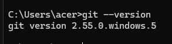
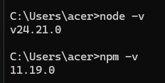
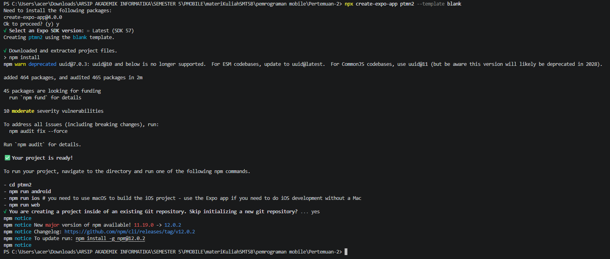

# Praktikum Menyiapkan Lingkungan Pengembangan dan Memulai Pemprograman Mobile (React Native) #

## Tujuan Pembelajaran ##
Mahasiswa mampu:
1. Menyiapkan lingkungan pengembangan dan memulai pemrograman mobile (React Native)
2. Membuat aplikasi mobile dengan React Native
3. Menyelesaikan Tugas CV sederhana dengan React Native

## Materi dan Laporan Praktikum ##
1. Menyiapkan lingkungan pengembangan dan memulai pemprograman mobile (React Native)
    - Memastikan instalasi Git bash
    - cek Instalasi Git bash (git --version)
    - bukti Verifikasi 
    
    - Memastikan Node.JS dan NPM
        - Download dan Install Node.JS di https://nodejs.org/en/download
        - Konfirmasi Node.JS dan NPM (node -v, npm -v)
        

2. Membuat aplikasi / Project baru dengan React Native Framework Expo Go
    - Buka dan baca dokumentasi resmi link https://docs.expo.dev/
    - Buka dan baca dokumentasi resmi link https://reactnative.dev/docs/getting-started/
    - Memulai Membuat project baru
    - open terminal change directory ke Pertemuan-2
    - Masukan perintah (npx create-expo-app ptmn2 --template blank)
    - bukti verifikasi
    
    - Running Project
        - Cd ke pmtn2
        - npx expo start
        - Install Expo Go di Android atau IOS
        - bosa juga menggunakan Web emulator di Laptop / PC
        - Setelah berhentikan (Crtl + C)
        - Install (npx expo i react-dom react-native-web)
        - npx expo start --web
    
4. Tugas Praktikum
    - Membuat aplikasi CV Sederhana dengan react native
    - Nama Lengkap
    - NIM
    - Asal Sekolah
    - Cita cita
    